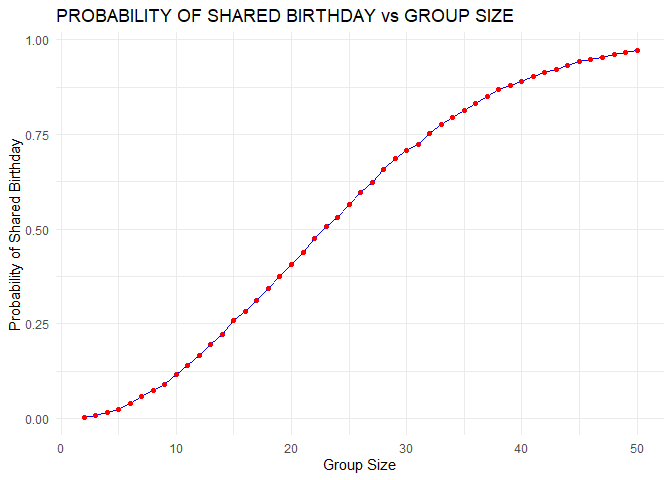
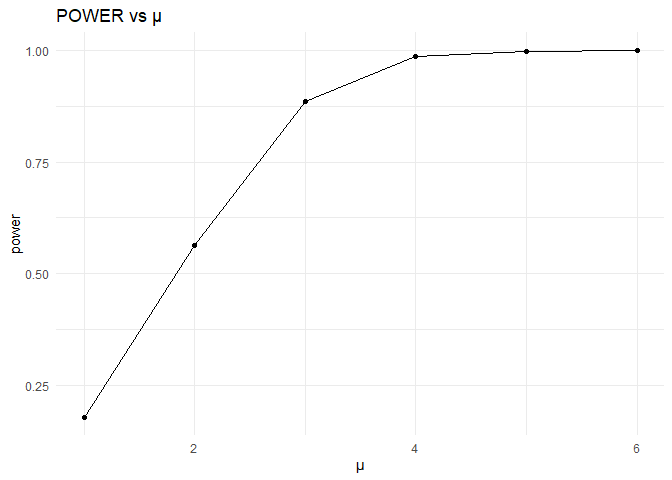
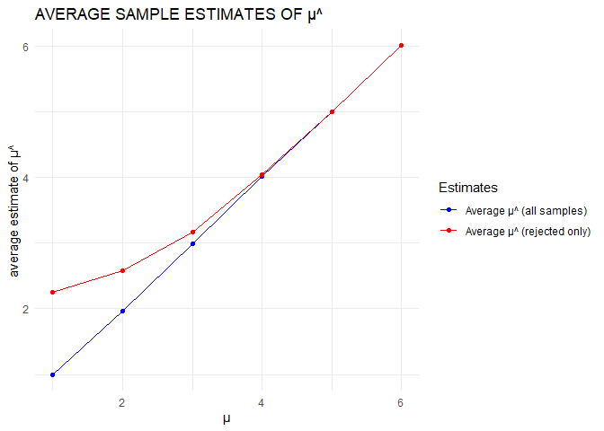
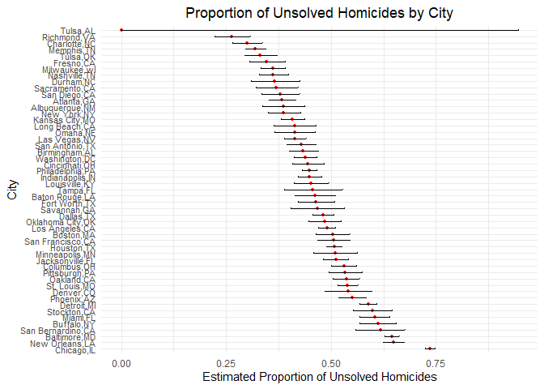

hw5
================
Senna
2024-11-05

Necessary packages are loaded.

### Problem 1

##### function that, for a fixed group size, randomly draws “birthdays” for each person; checks whether there are duplicate birthdays in the group; and returns TRUE or FALSE.

``` r
has_duplicate_birthday = function(n) {
  birthdays = sample(1:365, n, replace = TRUE)
  return(length(birthdays) != length(unique(birthdays)))
}  
```

FALSE means there are no duplicate. TRUE means there are duplicate.

##### Run this function 10000 times for each group size between 2 and 50. For each group size, compute the probability that at least two people in the group will share a birthday by averaging across the 10000 simulation runs. Make a plot showing the probability as a function of group size, and comment on your results.

``` r
group_sizes = 2:50  
num_it = 10000

p = numeric(length(group_sizes))

set.seed(123)

for (i in seq_along(group_sizes)) {
  n = group_sizes[i]
  
  sim_results = replicate(num_it, has_duplicate_birthday(n))
  p[i] = mean(sim_results)
}

plot_data = data.frame(group_sizes = group_sizes, p = p)

ggplot(plot_data, aes(x = group_sizes, y = p)) +
  geom_line(color = "blue") +
  geom_point(color = "red") +
  labs(title = "PROBABILITY OF SHARED BIRTHDAY vs GROUP SIZE",
       x = "Group Size",
       y = "Probability of Shared Birthday") +
  theme_minimal()
```

<!-- --> As
the group size increases, the probability of shared birthday increases.
However, the relationship is not perfectly linear. We observe an
increased rate of increase as group size exceeds 10, and a decreased
rate of increase as group size exceeds 30. The probability approaches
nearly 100% as the group size approaches 50.

### Problem 2

##### First set the following design elements: Fix n=30, Fix σ=5, Set μ=0

##### Generate 5000 datasets from the model x∼Normal\[μ,σ\]

``` r
n = 30
sigma = 5
mu = 0
num_datasets = 5000

set.seed(123)  
datasets = vector("list", num_datasets) 

for (i in 1:num_datasets) {
  datasets[[i]] = rnorm(n, mean = mu, sd = sigma) 
}
```

##### For each dataset, save μ^ and the p-value arising from a test of H:μ=0 using α=0.05.

``` r
alpha = 0.05

results = data.frame(mu_h = numeric(num_datasets), p_value = numeric(num_datasets))

for (i in 1:num_datasets) {
  datasets[[i]] = rnorm(n, mean = mu, sd = sigma)
  t_result = tidy(t.test(datasets[[i]], mu = 0))
  
  results$mu_h[i] = t_result$estimate
  results$p_value[i] = t_result$p.value
}

head(results)
```

    ##          mu_h    p_value
    ## 1 -0.66387231 0.52819967
    ## 2 -1.35795858 0.18093615
    ## 3  1.87595737 0.02677742
    ## 4 -0.03257952 0.97124777
    ## 5  0.64352057 0.41755352
    ## 6  0.87341103 0.30857275

##### Repeat the above for μ={1,2,3,4,5,6}, and complete the following:

##### Make a plot showing the proportion of times the null was rejected (the power of the test) on the y axis and the true value of μ on the x axis. Describe the association between effect size and power.

``` r
mus = 1:6


power_results = data.frame(mu = mus, power = numeric(length(mus)))

for (i in seq_along(mus)) {
  mu = mus[i]
  reject_null = 0
  
  for (j in 1:num_datasets) {
    dataset = rnorm(n, mean = mu, sd = sigma)
    
    t_result = tidy(t.test(dataset, mu = 0))
    p_value = t_result$p.value
    
    if (p_value < alpha) {
      reject_null = reject_null + 1
    }
  }
  
  power_results$power[i] <- reject_null / num_datasets
}
```

``` r
ggplot(power_results, aes(x = mu, y = power)) +
  geom_line() +
  geom_point() +
  labs(
    title = "POWER vs μ",
    x = "μ",
    y = "power"
  ) +
  theme_minimal()
```

<!-- -->
There is a positive association between power and μ (effect size). This
means that having a larger effect size makes it easier to detect a
significant effect, which increases the probability of rejecting the
null hypothesis. The positive association is not linear. The rate of
increase of power is steep from 1 to 3, but noticeably slows down
afterwards. When μ exceeds 4, the power remains close to 1.

##### Make a plot showing the average estimate of μ^ on the y axis and the true value of μ on the x axis. Make a second plot (or overlay on the first) the average estimate of μ^ only in samples for which the null was rejected on the y axis and the true value of μ on the x axis. Is the sample average of μ^ across tests for which the null is rejected approximately equal to the true value of μ? Why or why not?

``` r
estimate_results = data.frame(
  mu = mus,
  avg_all = numeric(length(mus)),
  avg_rejected = numeric(length(mus))
)


for (j in seq_along(mus)) {
  mu = mus[j]
  muh_all = numeric(num_datasets)
  muh_rejected = numeric(0)  
  
  for (i in 1:num_datasets) {
    dataset = rnorm(n, mean = mu, sd = sigma)
    t_result = tidy(t.test(dataset, mu = 0))
    muh = t_result$estimate
    p_value = t_result$p.value
    
    muh_all[i] = muh
    
    if (p_value < 0.05) {
      muh_rejected = c(muh_rejected, muh)
    }
  }
  
  estimate_results$avg_all[j] = mean(muh_all)
  estimate_results$avg_rejected[j] = mean(muh_rejected, na.rm = TRUE)
}
```

``` r
ggplot(estimate_results, aes(x = mu)) +
  geom_line(aes(y = avg_all, color = "Average μ^ (all samples)")) +
  geom_point(aes(y = avg_all, color = "Average μ^ (all samples)")) +
  geom_line(aes(y = avg_rejected, color = "Average μ^ (rejected only)")) +
  geom_point(aes(y = avg_rejected, color = "Average μ^ (rejected only)")) +
  labs(
    title = "AVERAGE SAMPLE ESTIMATES OF μ^",
    x = "μ",
    y = "average estimate of μ^"
  ) +
  scale_color_manual(values = c("blue", "red"), name = "Estimates") +
  theme_minimal()
```

<!-- -->
Yes. When we reject the null, we are identifying tests where the sample
μ^ reflects the true value. This leads the average of these μ^ to
approximate the true μ, especially when the we have a large number of
tests (law of large numbers), which we do in this case.

### Problem 3

##### Describe the raw data.

``` r
homicide_df = read_csv("./homicide-data.csv")
```

    ## Rows: 52179 Columns: 12
    ## ── Column specification ────────────────────────────────────────────────────────
    ## Delimiter: ","
    ## chr (9): uid, victim_last, victim_first, victim_race, victim_age, victim_sex...
    ## dbl (3): reported_date, lat, lon
    ## 
    ## ℹ Use `spec()` to retrieve the full column specification for this data.
    ## ℹ Specify the column types or set `show_col_types = FALSE` to quiet this message.

The data contains 52179 criminal homicides over a decade in 50 largest
cities in America. The variables include uid, reported_date,
victim_last, victim_first, victim_race, victim_age, victim_sex, city,
state, lat, lon, disposition. The data was cleaned and standardized to
ensure accuracy. The data can provide insights into patterns in urban
violence.

##### Create a city_state variable (e.g. “Baltimore, MD”) and then summarize within cities to obtain the total number of homicides and the number of unsolved homicides (those for which the disposition is “Closed without arrest” or “Open/No arrest”).

``` r
homicide_df = homicide_df|>
  mutate(city_state = paste (city, state, sep = ","))

citystate_df = homicide_df|>
  group_by(city_state)|>
  summarise(
    total_hom = n(),
    unsolved_hom = sum(disposition == "Closed without arrest" | 
                               disposition == "Open/No arrest", na.rm = TRUE)
  )

head(citystate_df)
```

    ## # A tibble: 6 × 3
    ##   city_state     total_hom unsolved_hom
    ##   <chr>              <int>        <int>
    ## 1 Albuquerque,NM       378          146
    ## 2 Atlanta,GA           973          373
    ## 3 Baltimore,MD        2827         1825
    ## 4 Baton Rouge,LA       424          196
    ## 5 Birmingham,AL        800          347
    ## 6 Boston,MA            614          310

##### For the city of Baltimore, MD, use the prop.test function to estimate the proportion of homicides that are unsolved; save the output of prop.test as an R object, apply the broom::tidy to this object and pull the estimated proportion and confidence intervals from the resulting tidy dataframe.

``` r
baltimore_df = homicide_df |>
  filter (city == "Baltimore" & state == "MD")

baltimore_homicide = nrow (baltimore_df)
baltimore_unsolved =  sum(baltimore_df$disposition == "Closed without arrest" | 
                          baltimore_df$disposition == "Open/No arrest", 
                          na.rm = TRUE)
```

``` r
prop_result = tidy(prop.test(baltimore_unsolved, baltimore_homicide))
prop_esti = prop_result$estimate
ci = prop_result|>
  select (conf.low , conf.high)

prop_result
```

    ## # A tibble: 1 × 8
    ##   estimate statistic  p.value parameter conf.low conf.high method    alternative
    ##      <dbl>     <dbl>    <dbl>     <int>    <dbl>     <dbl> <chr>     <chr>      
    ## 1    0.646      239. 6.46e-54         1    0.628     0.663 1-sample… two.sided

``` r
prop_esti
```

    ##         p 
    ## 0.6455607

``` r
ci
```

    ## # A tibble: 1 × 2
    ##   conf.low conf.high
    ##      <dbl>     <dbl>
    ## 1    0.628     0.663

##### Now run prop.test for each of the cities in your dataset, and extract both the proportion of unsolved homicides and the confidence interval for each. Do this within a “tidy” pipeline, making use of purrr::map, purrr::map2, list columns and unnest as necessary to create a tidy dataframe with estimated proportions and CIs for each city.

``` r
city_result = citystate_df|>
  mutate (
    prop_test = map2(unsolved_hom, total_hom, ~ prop.test(.x,.y)),
    tidy_res = map(prop_test, tidy)
  )|>
  unnest (tidy_res)|>
  select (city_state, total_hom, unsolved_hom, estimate, conf.low, conf.high)
```

    ## Warning: There was 1 warning in `mutate()`.
    ## ℹ In argument: `prop_test = map2(unsolved_hom, total_hom, ~prop.test(.x, .y))`.
    ## Caused by warning in `prop.test()`:
    ## ! Chi-squared approximation may be incorrect

##### Create a plot that shows the estimates and CIs for each city – check out geom_errorbar for a way to add error bars based on the upper and lower limits. Organize cities according to the proportion of unsolved homicides.

``` r
city_result = city_result|>
  arrange (desc(estimate))|>
  mutate(city_state = factor(city_state, levels = city_state))

ggplot(city_result, aes(x = city_state, y = estimate)) +
  geom_point(size = 1, color = "red") + 
  geom_errorbar(aes(ymin = conf.low, ymax = conf.high), width = 0.2) + 
  coord_flip() +  
  labs(
    title = "Proportion of Unsolved Homicides by City",
    x = "City",
    y = "Estimated Proportion of Unsolved Homicides"
  ) +
  theme_minimal() +
  theme(
    axis.text.y = element_text(size = 8),
    plot.title = element_text(hjust = 0.5)
  )
```

<!-- -->
